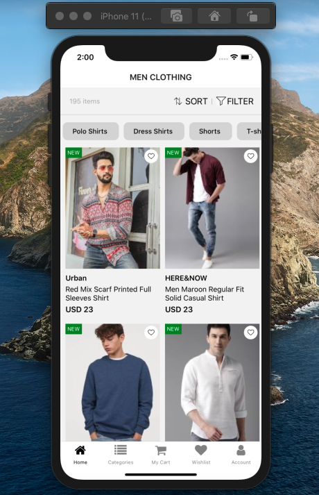

# ReactNative_Assignment
# Assignment on React Native Component-3

https://drive.google.com/file/d/11w9OJLKNSKM1sf_vrNcFaFjligyk7-Pi/view

Create the above screen in React-Native 

    1. Tab Navigation needs to integrated 
    2. Home tab must be selected 
    3. Icons can be fetched from icons8.com 
    4. Sort, filter, wishlist should be touchable
    5. No need for back icon

Refer src -> components -> design.js for the code

