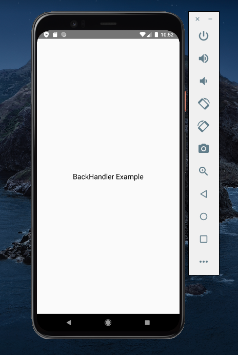
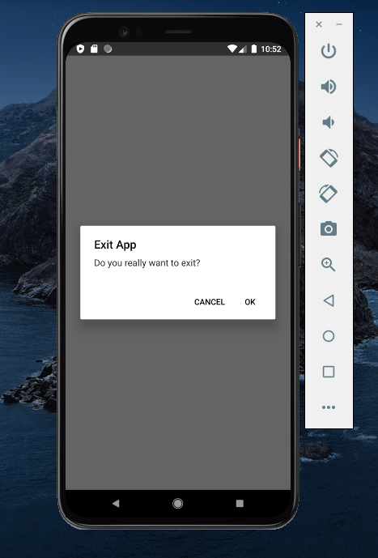
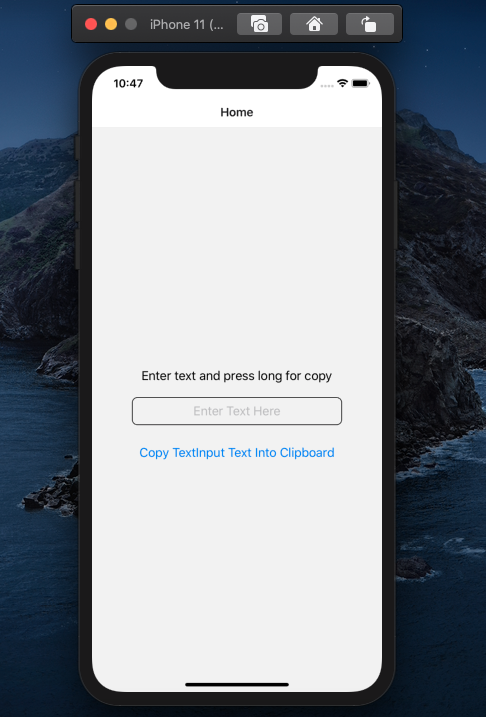
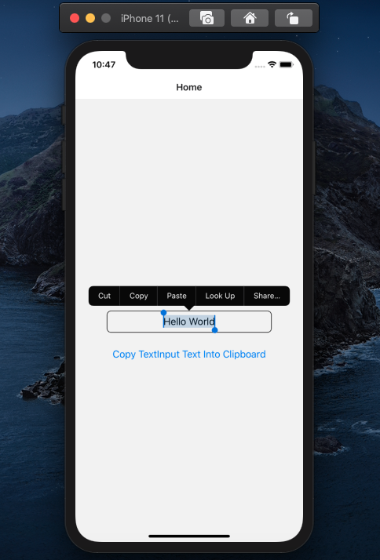
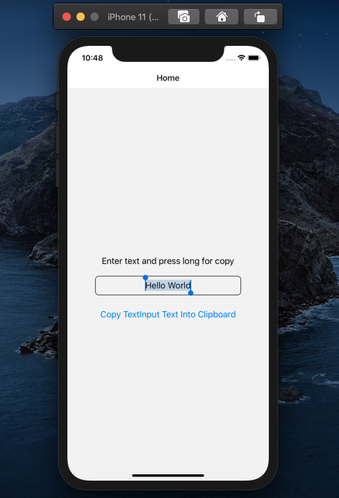
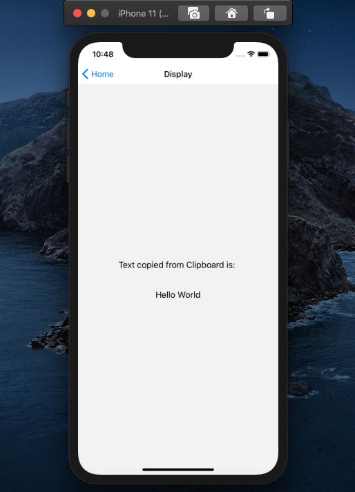

# ReactNative_Assignment
# Assignment on React Native Component-5

Use Alert, intercept Back Press and show the text to confirm go back.

Refer src -> components -> BackHandlerEx.js for the code

  

Use Clipboard to move text from one screen to another.

Refer src -> components -> StackClipboard.js for the code

