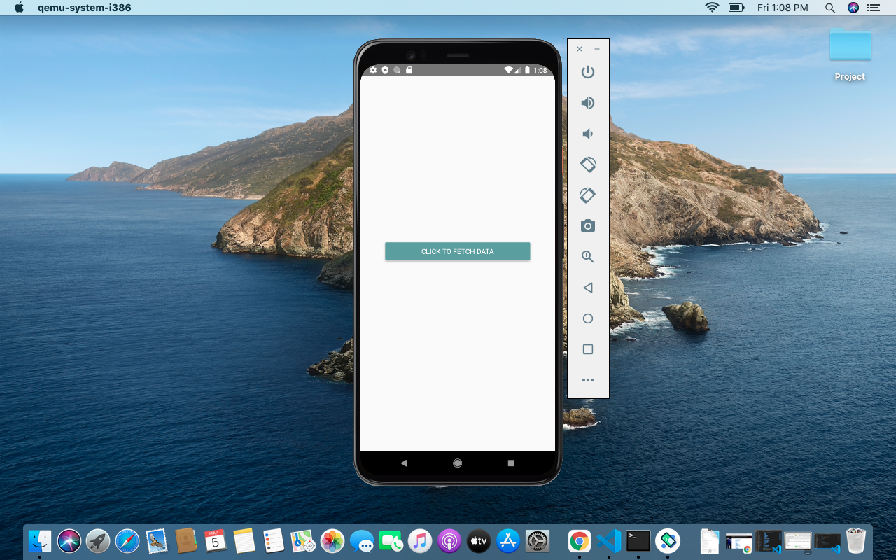
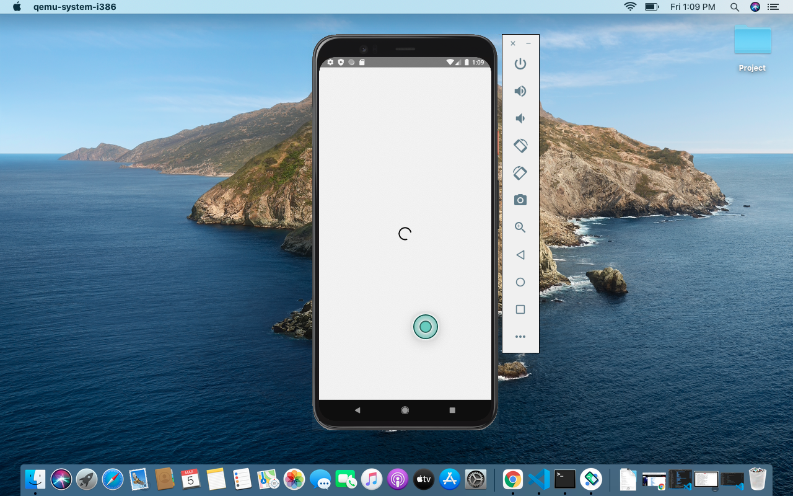
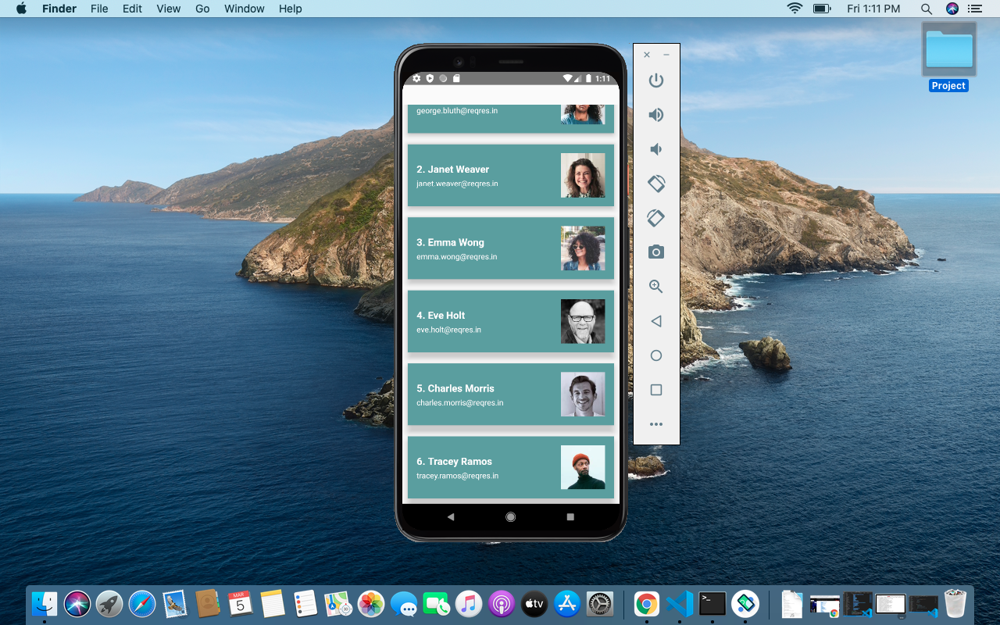

# ReactNative_Assignment
# Assignment on React Native Debugging

1) Update the code structure 

    Created src folder.
    Created assets and components in src folder.
    Moved all the js files in the components folder.
    

2) Create a new Screen 

Add a button FETCH Data
On click present a loader and make an API call 
List the data on the same screen, existing button and loader should be removed
API Path : https://reqres.in/api/users

Method : GET 

Use fetch https://developer.mozilla.org/en-US/docs/Web/API/Fetch_API/Using_Fetch

Refer src->components->ApiCall.js file for the code

