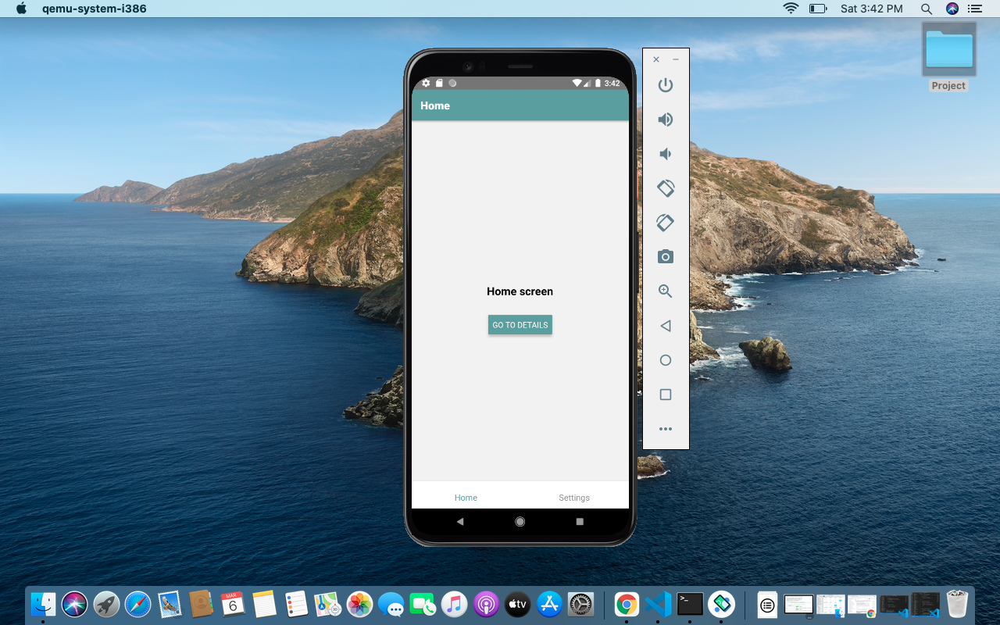
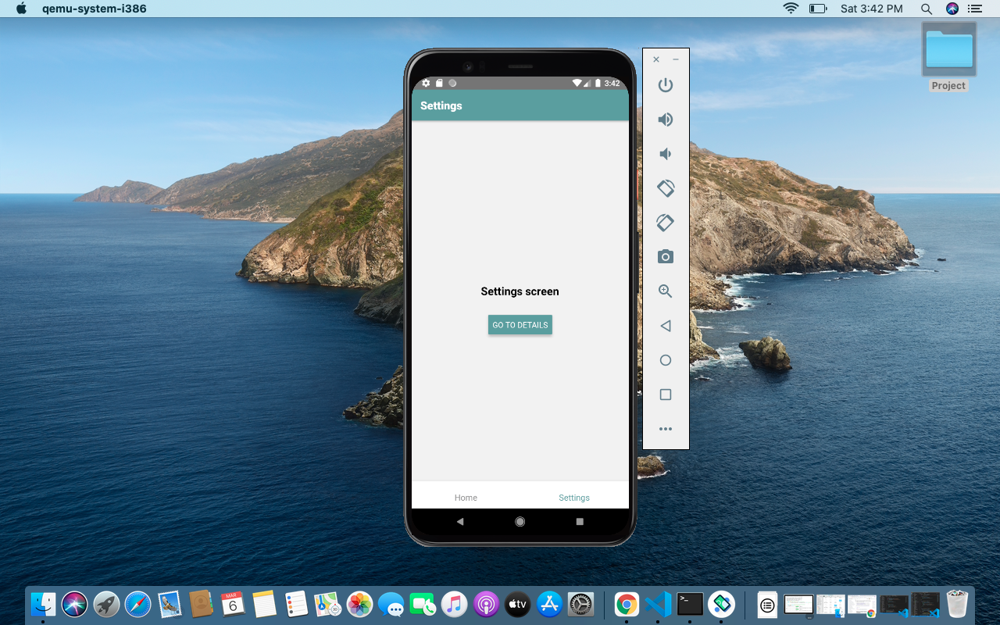
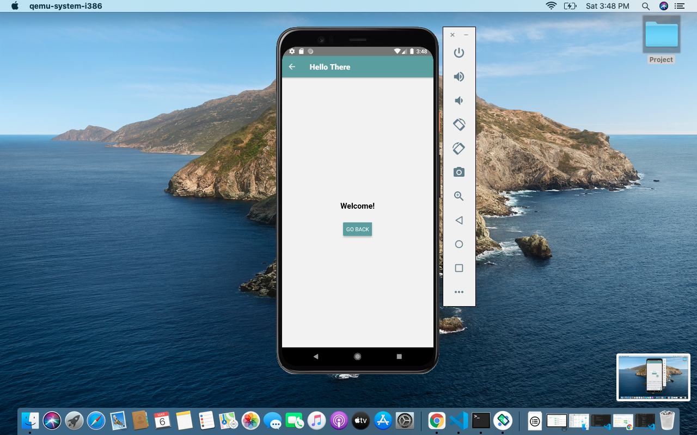

# ReactNative_Assignment
# Assignment on React Native Component-1

1. Create Stack, Tab and Drawer Navigator (optional)

Refer src -> components -> Navig.js for the code

3. Pass Props and Set it as header title

Refer src -> components -> PassProps.js for the code

