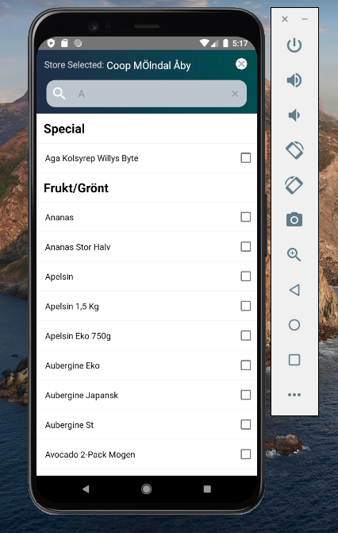
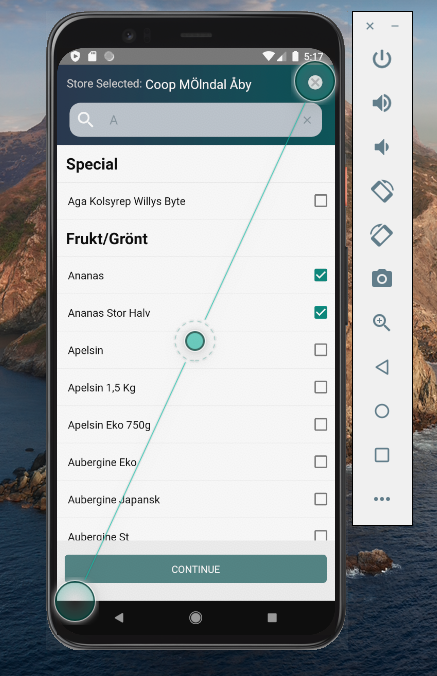

# ReactNative_Assignment
# Assignment 

https://docs.google.com/document/d/1j0NvknGAd-MpLlvaueVhpDEVRehdq9rd6uc7ZAbIfOs/edit

Refer src -> components -> SectionlistStack.js for the code of Assignment-1

Refer src -> components -> Modalgif.js for the code of Assignment-2

