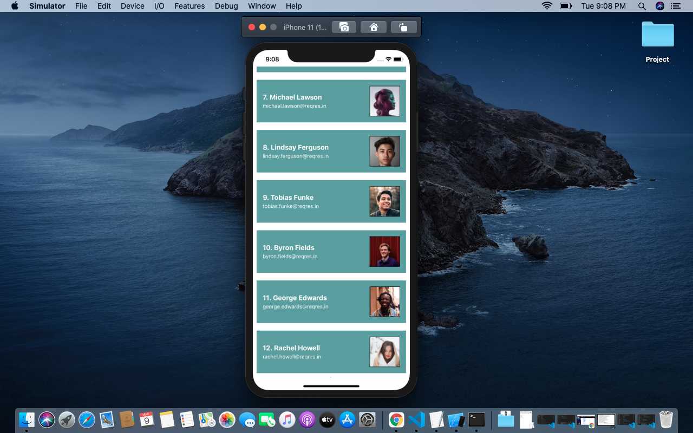

# ReactNative_Assignment
# Assignment on React Native Component-2

1. Implement WebView, show Activity indicator when WebView is loading

Refer src -> components -> WebView.js for the code

2. Use a switch to show hide the Slider and below slider show the slider value

Refer src -> components -> SwitchSlider.js for the code

3. Using api https://reqres.in/api/users?page=1 Render a Flatlist and implement pagination and pull to refresh show activity indicator below the flatlist when api is being called for the next page, use RefreshControl to show Activity indicator on top in case of pull to refresh

Refer src -> components -> FlatlistEx.js for the code

